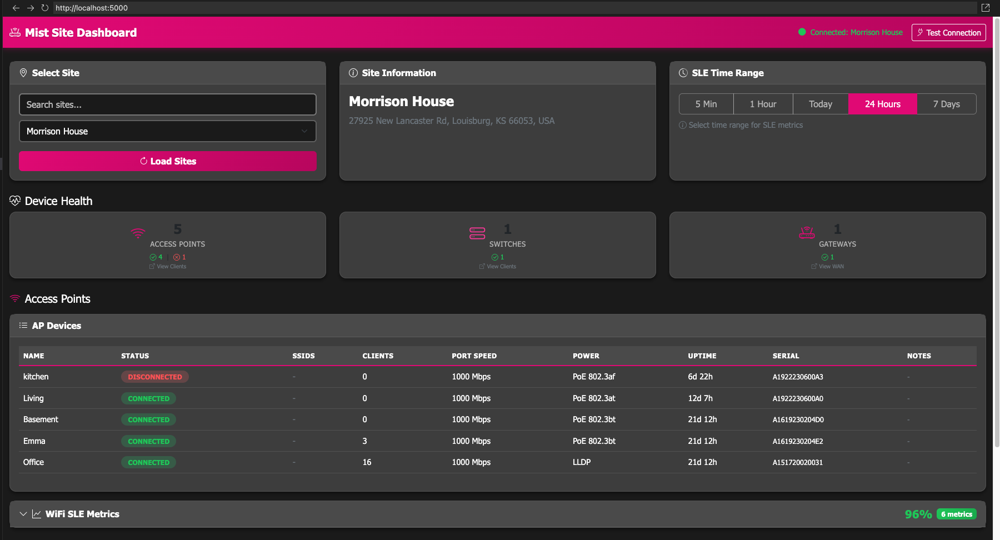
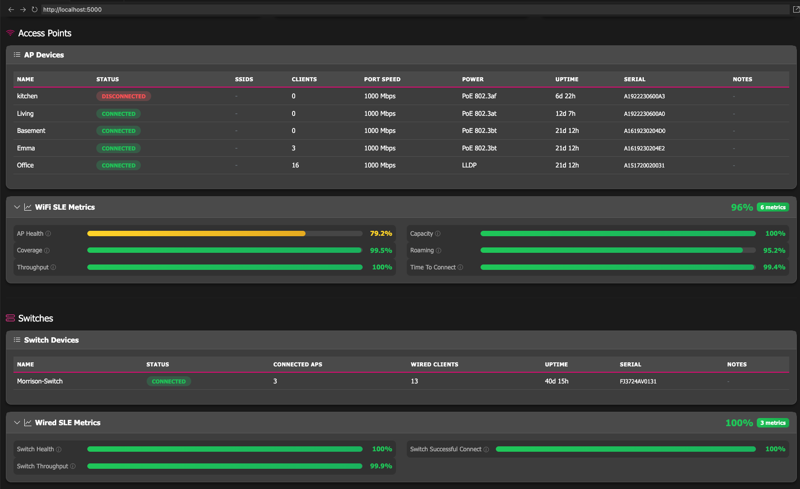
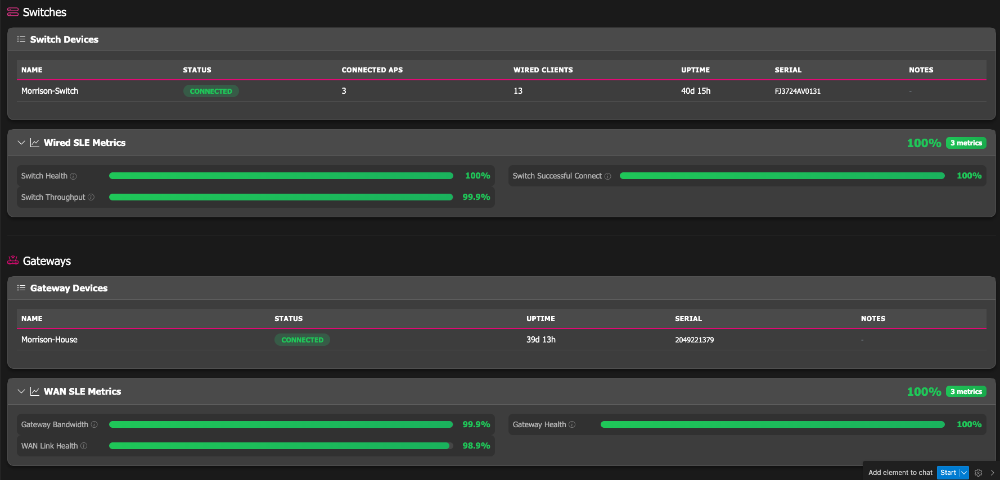
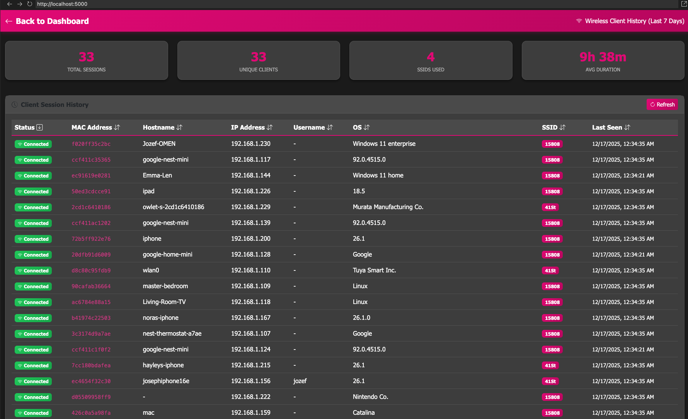
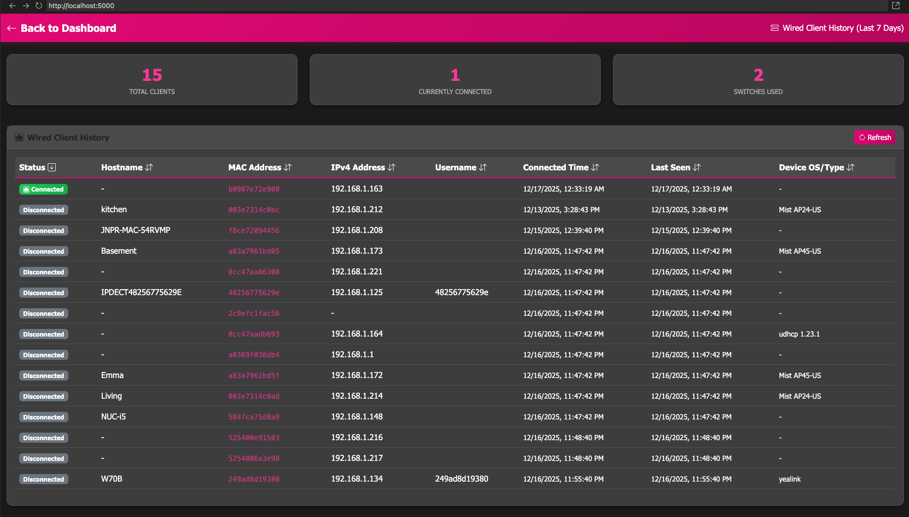
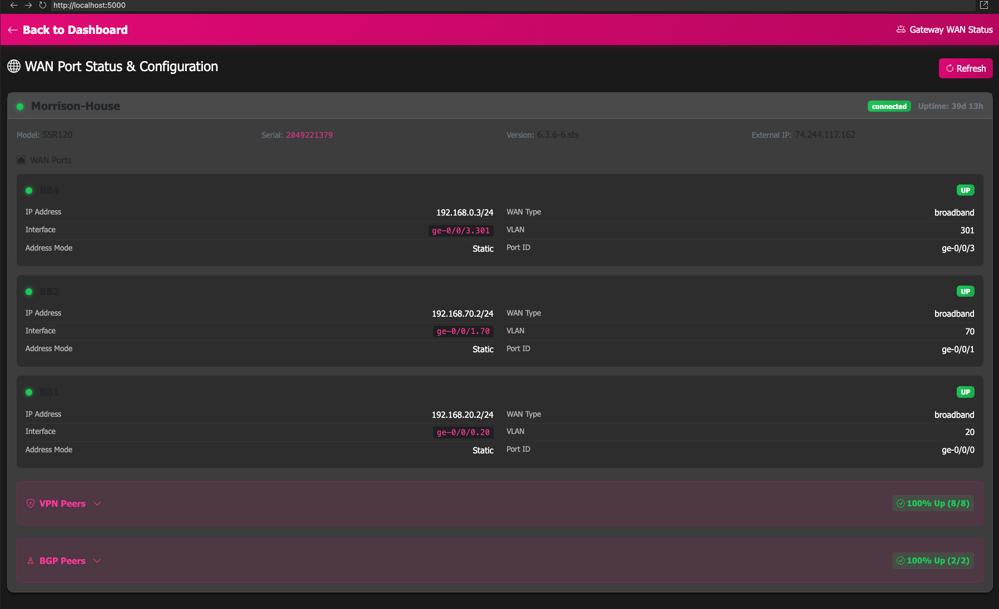
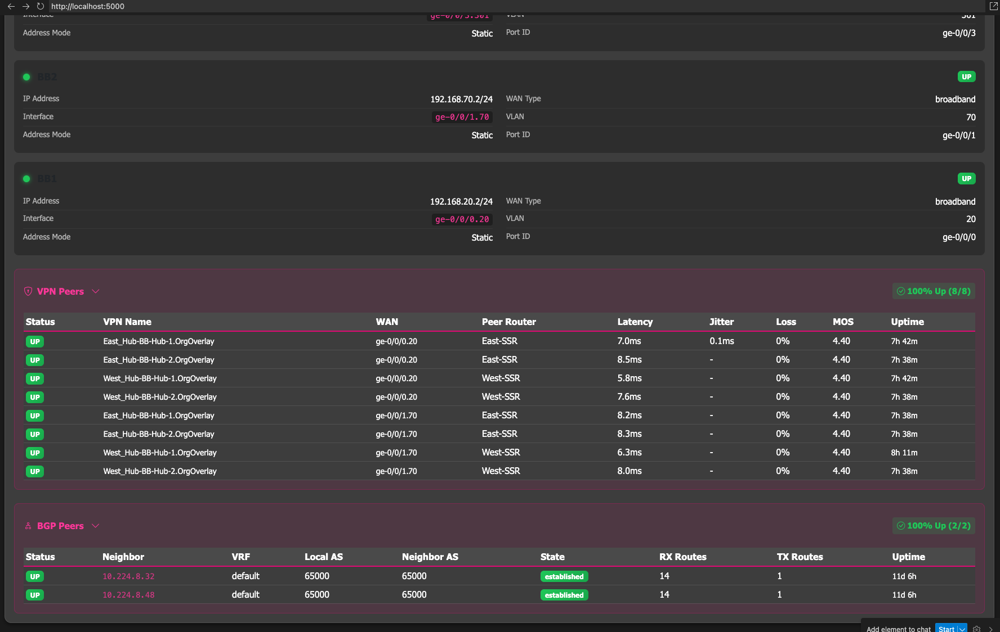

# MistSiteDashboard

View device health and SLE (Service Level Experience) metrics for Juniper Mist sites in a clean, modern web interface.


## Screenshots















## Features

- **Site Selection**: Browse and search through all sites in your Mist organization
- **Device Health**: Real-time status of Access Points, Switches, and Gateways
  - Connected/disconnected counts with visual indicators
  - Device tables with model, IP, uptime, version, and firmware info
  - Sortable columns for easy data analysis
- **SLE Metrics**: WiFi, Wired, and WAN Service Level Experience scores
  - Collapsible metric sections with average scores
  - Configurable time ranges (5 min, 1 hour, today, 24 hours, 7 days)
  - Color-coded thresholds (green/yellow/red)
- **Access Point Details**:
  - Connected WiFi clients per AP
  - Currently broadcasting SSIDs (resolved via device profiles)
  - Click-through to client details page
- **Gateway WAN Status**:
  - WAN port status with IP, speed, and traffic stats
  - VPN peer status with latency, jitter, loss, and MOS metrics
  - BGP peer status with neighbor info and route counts
  - Collapsible peer tables with percentage-up indicators
- **Client Details Pages**:
  - AP WiFi clients with signal strength, SSID, band, and data usage
  - Switch wired clients with port, VLAN, and MAC info
- **Dark Mode**: Modern dark theme with T-Mobile magenta accents, optimized for NOC environments
- **CSV Export**: Download any table as CSV with one-click export buttons
- **Container Ready**: Multi-architecture Docker/Podman support (amd64/arm64)

## Quick Start

### Using Docker/Podman with Environment File (Recommended)

1. **Pull the container image:**

   ```bash
   docker pull ghcr.io/jmorrison-juniper/mistsitedashboard:latest
   ```

2. **Create a `.env` file** in your preferred directory (e.g., `~/mistsitedashboard/.env`):

   ```bash
   mkdir -p ~/mistsitedashboard
   cat > ~/mistsitedashboard/.env << 'EOF'
   MIST_APITOKEN=your_api_token_here
   MIST_ORG_ID=your_org_id_here
   MIST_HOST=api.mist.com
   EOF
   ```

   > **Note:** For EU cloud, use `MIST_HOST=api.eu.mist.com`

3. **Run the container:**

   ```bash
   docker run -d \
     --name mistsitedashboard \
     -p 5000:5000 \
     --env-file ~/mistsitedashboard/.env \
     ghcr.io/jmorrison-juniper/mistsitedashboard:latest
   ```

4. **Access the dashboard** at: `http://localhost:5000`

### Using Inline Environment Variables

```bash
docker run -d \
  --name mistsitedashboard \
  -p 5000:5000 \
  -e MIST_APITOKEN=your_api_token_here \
  -e MIST_ORG_ID=your_org_id_here \
  ghcr.io/jmorrison-juniper/mistsitedashboard:latest
```

### Docker Compose

Create a `docker-compose.yml` file:

```yaml
services:
  mistsitedashboard:
    image: ghcr.io/jmorrison-juniper/mistsitedashboard:latest
    container_name: mistsitedashboard
    ports:
      - "5000:5000"
    env_file:
      - .env
    restart: unless-stopped
```

Create a `.env` file in the same directory:

```env
MIST_APITOKEN=your_api_token_here
MIST_ORG_ID=your_org_id_here
MIST_HOST=api.mist.com
TZ=America/Chicago
```

Then run:

```bash
docker-compose up -d
```

Access at: `http://your-server-ip:5000`

## Configuration

| Variable       | Required | Default      | Description                          |
| -------------- | -------- | ------------ | ------------------------------------ |
| MIST_APITOKEN  | Yes      | -            | Your Mist API token                  |
| MIST_ORG_ID    | No       | auto-detect  | Organization ID                      |
| MIST_HOST      | No       | api.mist.com | API host (api.eu.mist.com for EU)    |
| PORT           | No       | 5000         | Web interface port                   |
| LOG_LEVEL      | No       | INFO         | DEBUG, INFO, WARNING, ERROR          |
| TZ             | No       | UTC          | Container timezone                   |

### Getting Your Mist API Token

1. Log into the Mist dashboard at <https://manage.mist.com>
2. Navigate to **Organization** > **Settings** > **API Token**
3. Click **Create Token** and copy the token value

### Finding Your Organization ID

The Organization ID can be found in the Mist dashboard URL:

```text
https://manage.mist.com/admin/?org_id=YOUR_ORG_ID_HERE
```

Or leave it empty and the dashboard will auto-detect your first available organization.

## Running as a Python Script (No Container)

If you prefer to run the dashboard directly without a container:

### Quick Start (Script)

```bash
# Clone the repository
git clone https://github.com/jmorrison-juniper/MistSiteDashboard.git
cd MistSiteDashboard

# Create and activate virtual environment
python3 -m venv venv
source venv/bin/activate  # On Windows: venv\Scripts\activate

# Install dependencies
pip install -r requirements.txt

# Create your .env file
cp .env.example .env
```

Edit the `.env` file with your credentials:

```env
MIST_APITOKEN=your_api_token_here
MIST_ORG_ID=your_org_id_here
MIST_HOST=api.mist.com
```

Run the application:

```bash
python app.py
```

Access at: `http://localhost:5000`

> **Note:** The `.env` file is automatically loaded by the application. Keep it in the same directory as `app.py`.

### Running in Background (Linux/macOS)

```bash
# Run in background with nohup
nohup python app.py > dashboard.log 2>&1 &

# Or use screen/tmux for persistent sessions
screen -S mistsitedashboard
python app.py
# Press Ctrl+A, then D to detach
```

## Mist API Endpoints Used

This dashboard uses the following endpoints from the [mistapi Python SDK](https://github.com/tmunzer/mistapi_python):

| Endpoint                                                 | Description                                                  |
| -------------------------------------------------------- | ------------------------------------------------------------ |
| `GET /api/v1/self`                                       | Get current user info (for org detection)                    |
| `GET /api/v1/orgs/:org_id`                               | Get organization details                                     |
| `GET /api/v1/orgs/:org_id/sites`                         | List all sites in organization                               |
| `GET /api/v1/orgs/:org_id/templates`                     | List WLAN templates (for SSID resolution)                    |
| `GET /api/v1/orgs/:org_id/wlans`                         | List organization WLANs                                      |
| `GET /api/v1/sites/:site_id/stats/devices`               | Get device statistics (APs, switches, gateways)              |
| `GET /api/v1/sites/:site_id/stats/devices?type=gateway`  | Get gateway stats including WAN interface status (`if_stat`) |
| `GET /api/v1/sites/:site_id/sle/:scope/:scope_id/metrics`| List available SLE metrics                                   |
| `GET /api/v1/sites/:site_id/sle/:scope/:scope_id/summary`| Get SLE summary scores                                       |
| `GET /api/v1/sites/:site_id/stats/wireless_clients`      | Get wireless client statistics                               |
| `GET /api/v1/sites/:site_id/clients/search`              | Search wireless clients                                      |
| `GET /api/v1/sites/:site_id/clients/sessions/search`     | Search wireless client sessions                              |
| `GET /api/v1/sites/:site_id/wired_clients/search`        | Search wired clients                                         |
| `GET /api/v1/orgs/:org_id/stats/peer_paths/search`       | Search VPN peer path stats                                   |
| `GET /api/v1/orgs/:org_id/stats/bgp_peers/search`        | Search BGP peer stats                                        |

## Architecture

```text
MistSiteDashboard/
├── app.py                 # Flask application & routes
├── mist_connection.py     # Mist API client
├── templates/
│   ├── index.html         # Main dashboard UI
│   ├── gateway_wan.html   # Gateway WAN status page
│   ├── ap_clients.html    # AP WiFi clients page
│   └── switch_clients.html # Switch wired clients page
├── requirements.txt       # Python dependencies
├── Dockerfile             # Container build
├── docker-compose.yml     # Container orchestration
└── .github/
    └── workflows/
        └── build-and-push.yml  # CI/CD pipeline
```

## Changelog

```json
{
  "24.12.17": {
    "feature-additions": [
      "Gateway WAN status page with port details",
      "VPN peer status with latency, jitter, loss, MOS metrics",
      "BGP peer status with neighbor info and route counts",
      "Collapsible VPN/BGP tables with percentage-up indicators",
      "AP WiFi clients detail page",
      "Switch wired clients detail page",
      "SSID display for APs (resolved via device profiles)",
      "Collapsible SLE metric sections with averages",
      "SLE time range selector (5min to 7 days)",
      "Sortable device tables",
      "Compact health summary cards"
    ],
    "fixes": [
      "API pagination for large sites (100+ devices)",
      "Invalid Date handling in timestamps",
      "Improved font readability"
    ]
  },
  "24.12.16": {
    "feature-additions": [
      "Initial release",
      "Site selection with search/filter",
      "Device health display (APs, Switches, Gateways)",
      "SLE metrics (WiFi, Wired, WAN)",
      "Device detail tables with status, uptime, version",
      "Dark mode UI optimized for NOC environments"
    ],
    "container": [
      "Multi-architecture support (amd64/arm64)",
      "GitHub Container Registry publishing",
      "Non-root container user for security"
    ]
  }
}
```

## Related Projects

- [MistHelper](https://github.com/jmorrison-juniper/MistHelper) - Comprehensive Mist API data export tool
- [mistapi_python](https://github.com/tmunzer/mistapi_python) - Python SDK for Mist API (by Thomas Munzer)

## License

MIT

---

Made for Juniper Mist network operations.
