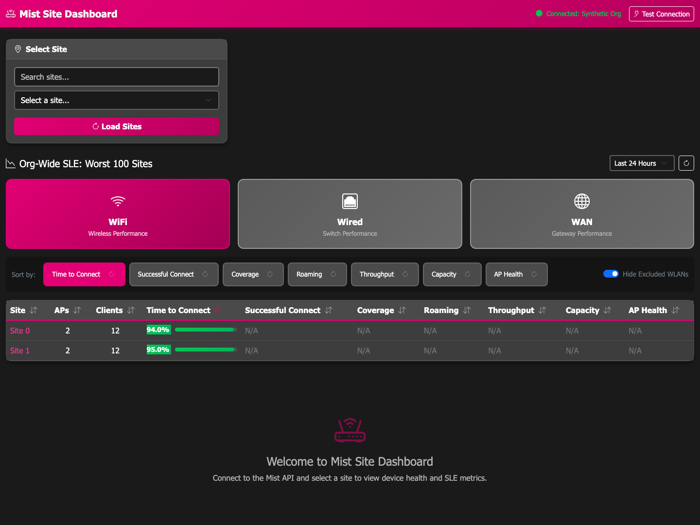
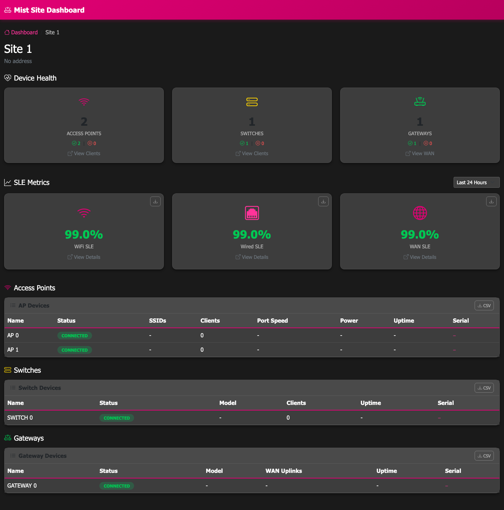
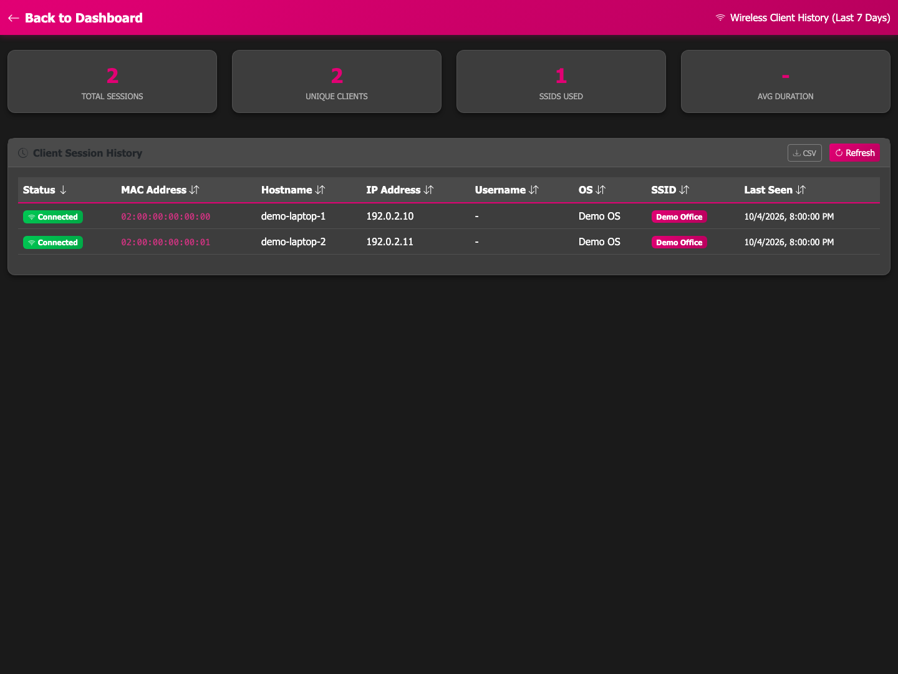
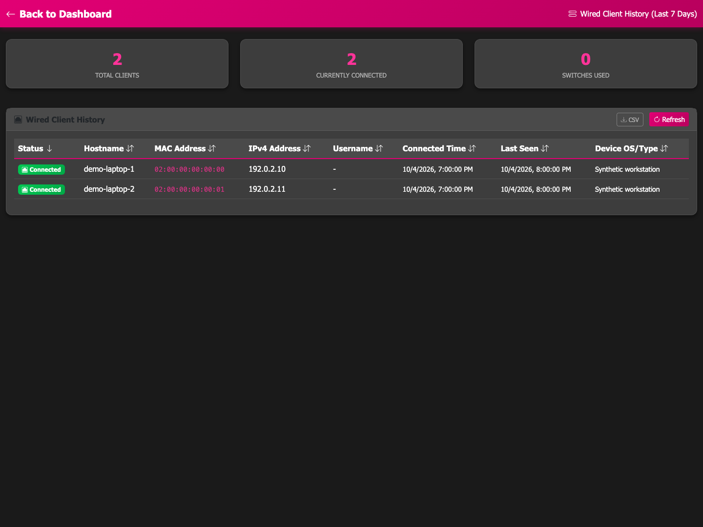

## What

**MistSiteDashboard** is a Flask web dashboard for Juniper Mist device health and
Service Level Experience (SLE). Explore organization performance, site health,
wireless and wired clients, and gateway WAN status.

These are genuine application screens rendered locally with synthetic data, not
live customer information.

## How

Follow the [user guide](docs/user-guide.md#quick-start) to configure a Mist API
token and start the dashboard in a container or
[directly with Python](docs/user-guide.md#running-as-a-python-script-no-container).
Open `http://localhost:5000`, select a site, and drill into health or SLE details.
Keep credentials out of source control.

For a credential-free local preview, use the
[offline demo and screenshot instructions](docs/offline-screenshots.md).

## Where

Source and issue tracking live in
[jmorrison-juniper/MistSiteDashboard](https://github.com/jmorrison-juniper/MistSiteDashboard).
Container images are published to `ghcr.io/jmorrison-juniper/mistsitedashboard`.
Detailed [features](docs/user-guide.md#features),
[configuration](docs/user-guide.md#configuration),
[API endpoints](docs/user-guide.md#mist-api-endpoints-used), and
[architecture](docs/user-guide.md#architecture) are in `docs/`.

## When

Use the dashboard during routine network checks or incident investigation.
Choose a time range to compare recent and historical service quality.
See the [changelog](docs/user-guide.md#changelog) for release history and
[performance monitoring](docs/user-guide.md#performance-monitoring) for timing
and benchmark guidance.

## Why

Bring device availability, service-quality scores, and affected clients together
so network operations staff can identify where to investigate next.
Use [CSV exports](docs/user-guide.md#features) for offline analysis.

## Who

Built for network operations engineers working with Juniper Mist.
Maintained by Joseph Morrison
([@jmorrison-juniper](https://github.com/jmorrison-juniper)).
See [related projects](docs/user-guide.md#related-projects).
Licensed under [CC BY-NC-SA 4.0](LICENSE).
